# Relatório de Entrega - Exercício Persistência de Dados 

## Informações Gerais
- **Disciplina:** Ferramentas para Análise e Desenvolvimento de Sistemas
- **Aluno:** Bernardo Souza ALvim
- **Código de Pessoa:** 859148

---

## Estrutura do Projeto
A estrutura do projeto está organizada da seguinte forma:

```
ProductAPI/
├── src/
│   ├── Controllers/
│   ├── Models/
│   ├── Services/
│   ├── rogram.cs
│   └── ...
├── report.md
└── ...
```

---

## Testes CRUD com Postman

### 1. **Rota de Criação (POST)**
- **Descrição:** Teste de criação de registros no banco de dados.
- **Teste 1**
  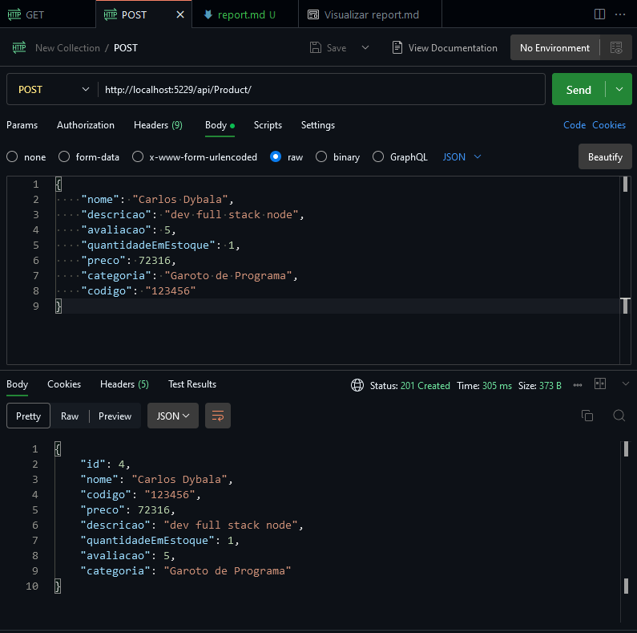
- **Teste 2**
  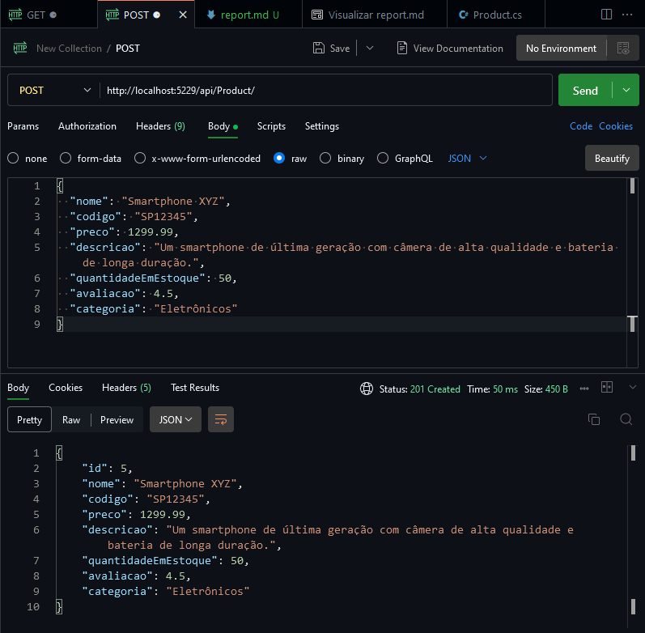
---

### 2. **Rota de Leitura Completa (GET)**
- **Descrição:** Teste de leitura de registros do banco de dados.
- **Teste 1**
  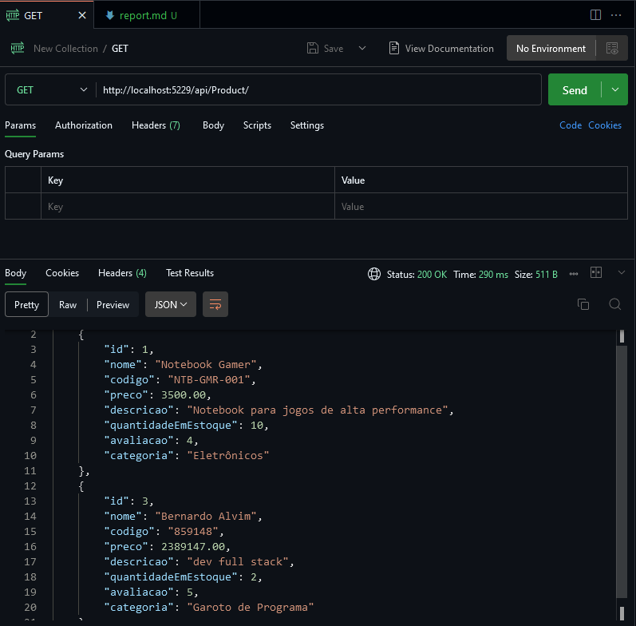
- **Teste 2**
  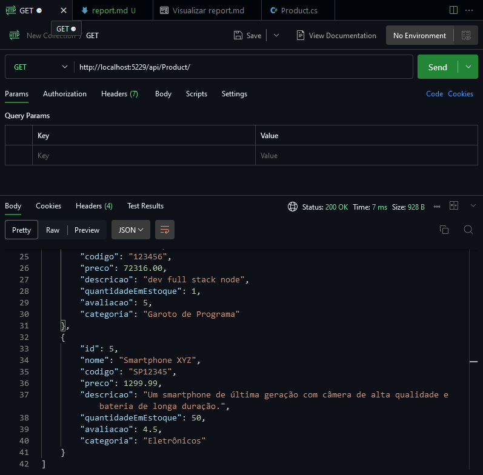
---

### 3. **Rota de Leitura por Codigo (GET)**
- **Descrição:** Teste de leitura de registros do banco de dados.
- **Teste 1**
  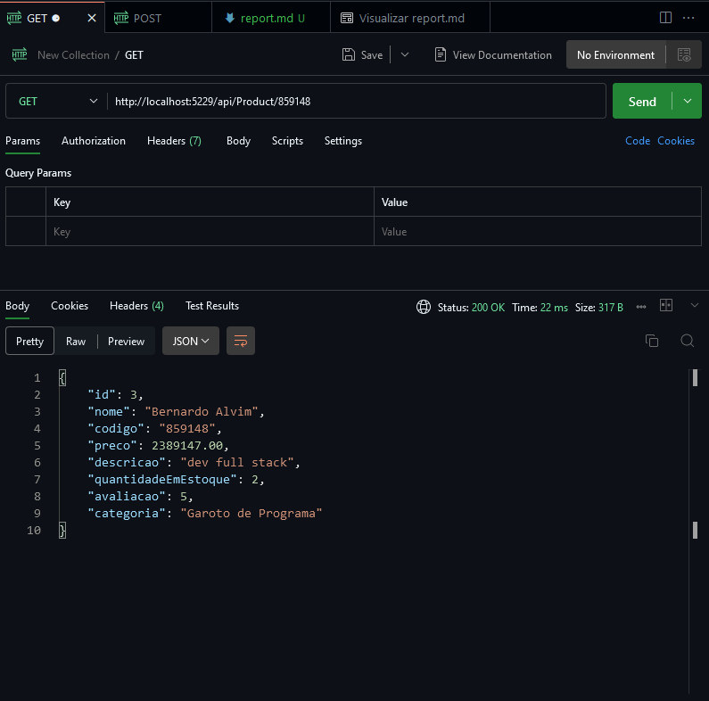
- **Teste 2**
  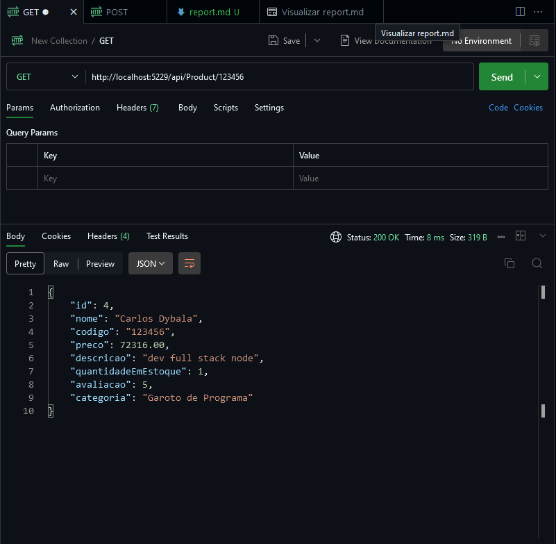
---

### 4. **Rota de Leitura por Categoria (GET)**
- **Descrição:** Teste de leitura de registros do banco de dados.
- **Teste 1**
  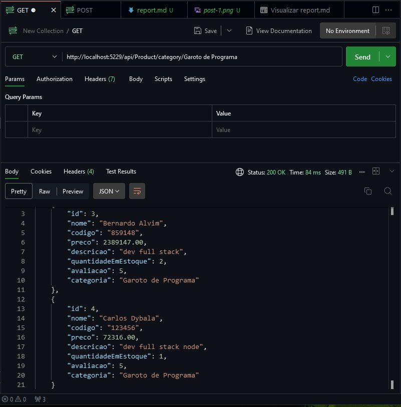
- **Teste 2**
  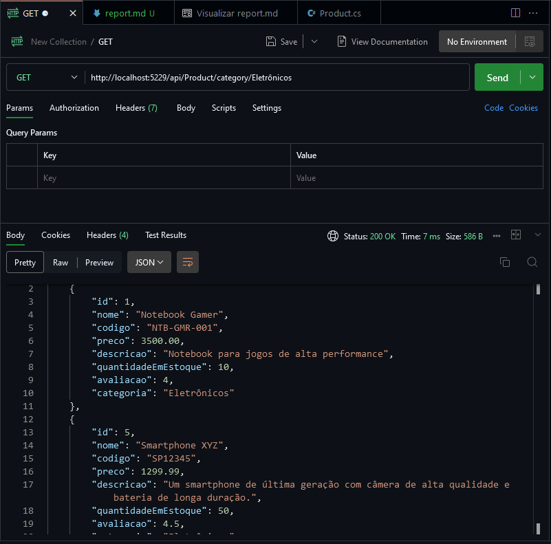
---

### 5. **Rota de Atualização (PUT)**
- **Descrição:** Teste de atualização de registros no banco de dados.
- **Teste 1**
  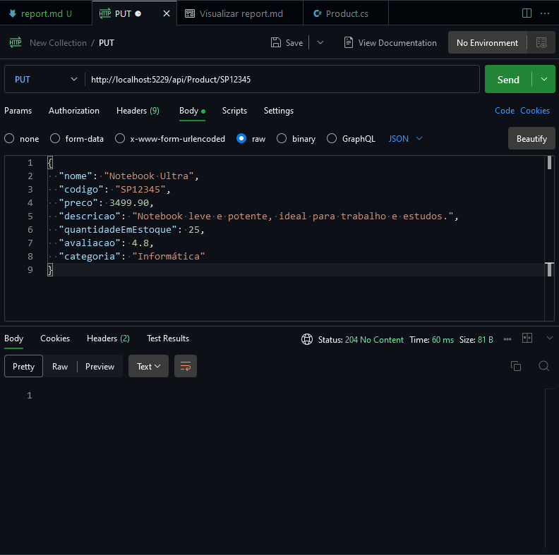
- **Teste 2**
  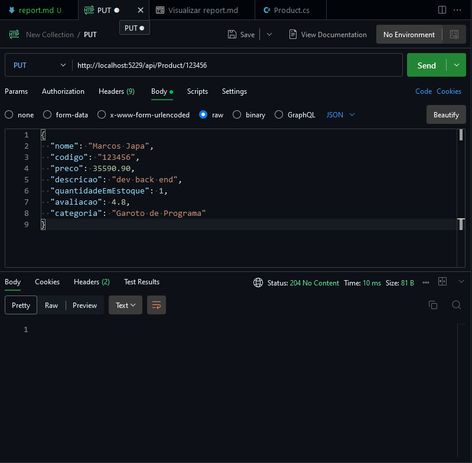
---

### 6. **Rota de Edição (PATCH)**
- **Descrição:** Teste de atualização de registros no banco de dados.
- **Teste 1**
  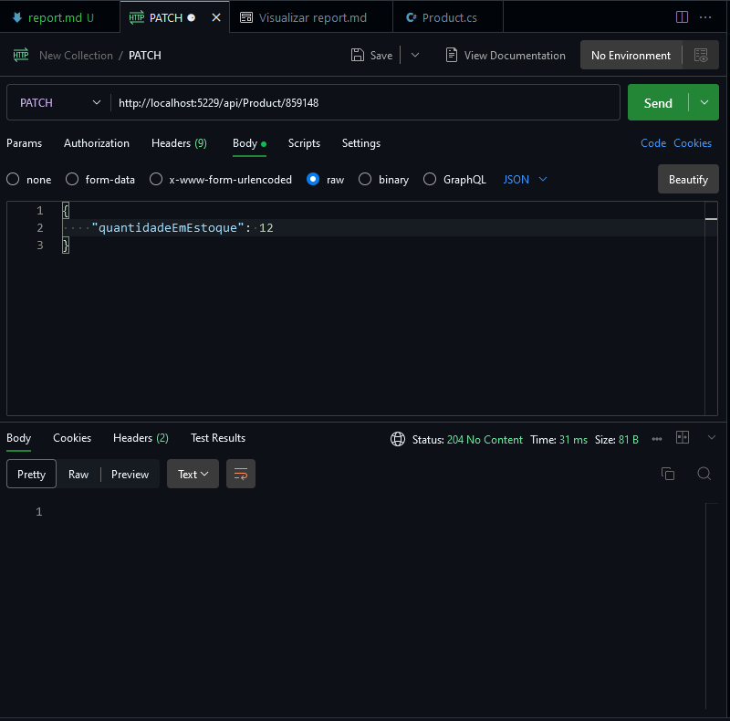
- **Teste 2**
  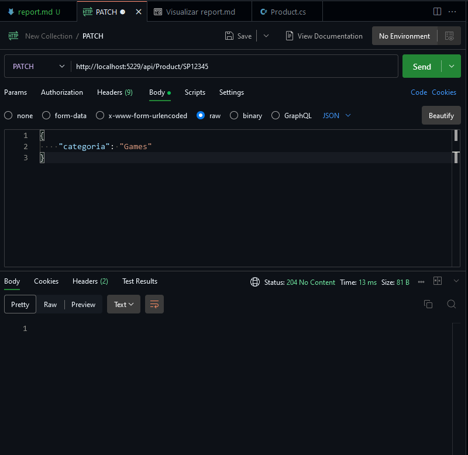
---

### 7. **Rota de Exclusão (DELETE)**
- **Descrição:** Teste de exclusão de registros no banco de dados.
- **Teste 1**
  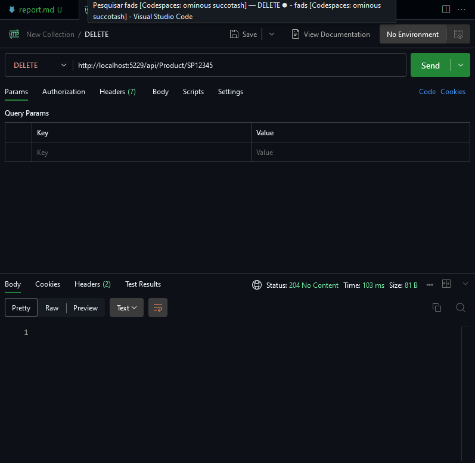
- **Teste 2**
  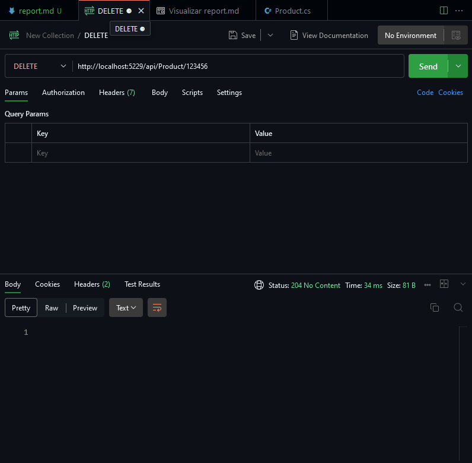
---

## Observações Finais
- **Banco de Dados Utilizado:** SQL Server
- **Ferramentas Utilizadas:**
  - Postman para testes de API.
  - Codespace do Github para desenvolvimento e testes.
